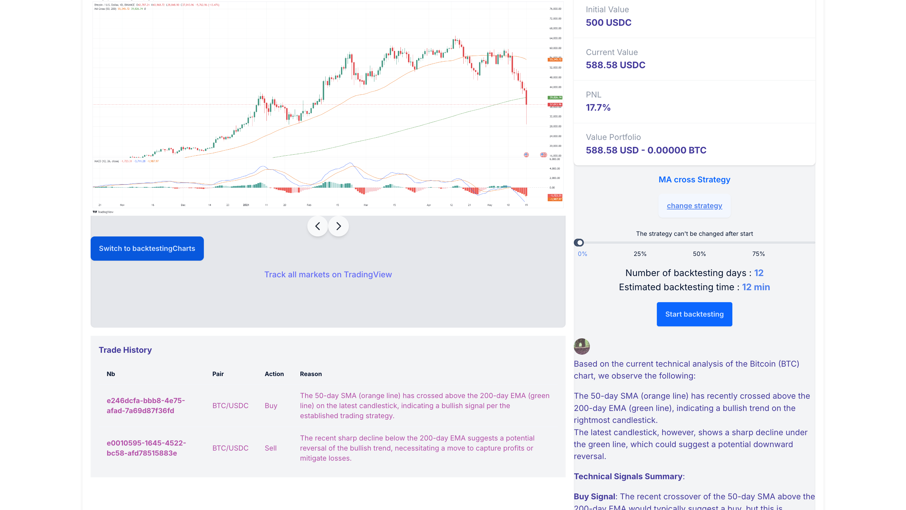

# Llm Trades

User owned trading strategies (on BNB Greenfield), backtested by onchain Llm.



### Overview

Our app allow a user to create a trading strategy and give it to an llm to backtest it.

Everytime, the user keep the ownership of the strategy using BNB greenfield.

Each decision of the llm is recorded onchain using GaladrielAI.

### How it works

- The user select or create a new trading strategy
- The user define an amount of USDC
- The can then apply the strategy to the actual BTC/USDC graph or backtest it using historical data

### Roadmap

- [x] Backtesting on BTC/USDC
- [ ] Auto trade (execute the strategy everyday with real money)
- [ ] Monetization of the strategy 

### Technical Stack

**FrontEnd**
- Typescript
- React / Vite / Tailwind / DaisyUI
- Vercel

**LLM**
- GaladrielAI

**Data Ownership**
- BNB Greenfield


### Getting started

- Setup the .env file

- Install Dependencies:
```bash
bun install
```

- Start the Development Server:
```bash
 bun run dev
```

This command will start the Vite development server. By default, the application will be available at `http://localhost:5173`.
****